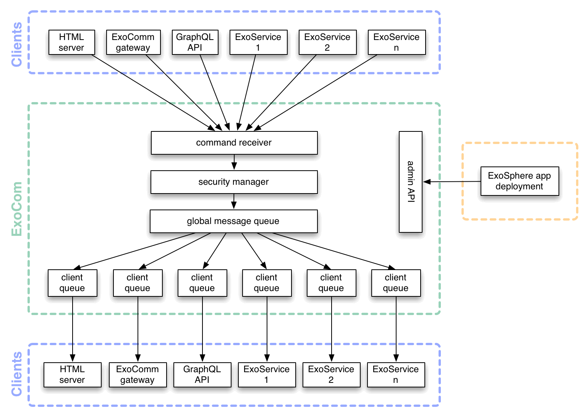

# Exosphere Communication Server

[](https://circleci.com/gh/Originate/exocom-dev)

This is the development version of the Exosphere Communication Server.


## Installation

```
$ npm i -g exocom-dev
```

## APIs

Exocom can be used via 2 separate APIs.


### Command-line API

This is the main way to use ExoComDev by end users (Exosphere developers).

```
$ exocom
```

The default port is 3100. To run it at another port:

```
$ exocom --port <port number>
```

More details around configuring the port [here](features/configuring-the-port.feature).


### JavaScript API

You can integrate Exocom into your own NodeJS application through its JavaScript API.
The [CLI](src/cli.ls) is implemented using the JavaScript API.

```livescript
new ExoCom
  ..on 'error', (err) -> # boo!
  ..on 'listening', (port) -> # woohoo!
  ..listen 3100
```


## Functionality

Exocom [broadcasts](features/broadcasting-messages.feature) messages to other services.
Services have to [register](features/registering-services.feature) with it first
to tell it which messages they want to send and receive.


## Architecture




## Development

See our [developer guidelines](CONTRIBUTING.md)
