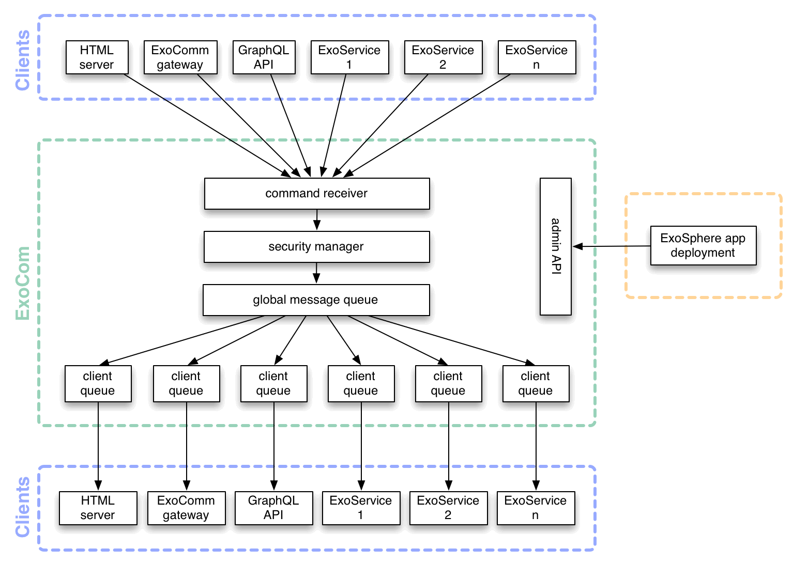

# Exocom Development Guidelines


To boot up Exocom by itself on the command line.

```
$ exocom [--port <port number>]
```

The default port is 3100.
More details around configuring the port [here](features/configuring-the-ports.feature).


## Terminology

- there are a number of __service types__, for example the "web" service, the "todo" service, etc
- each service type has a number of instances. We call them __clients__ of Exocom to avoid the word "service" again.
- each client has a unique name to identify it, e.g. "web #1"
- the service configuration file defines which messages a service is allowed to send and receive.
  This information is called __routing__
- service instances (clients) can send __messages__ to each other.
  A service can only send messages of a __message type__ it is allowed to send,
  which is specified in the routing information.
- services can use different __internal message names__ than what is used on the bus
  (which are the __public message names__).


## Architecture

ExoCom is implemented using the _micro-kernel_ pattern:
as a number of relatively independent subsystems that are integrated through
a small and lightweight core that only provides
communication between the subsystems.
Each subsystem provides a particular set of functionality,
and is tested and implemented independently,
as a set of one or more classes.

* [HttpListener](src/http-listener):
  implements the HTTP endpoint that services talk to in order to make requests to ExoCom
* [ClientRegistry](src/client-registry):
  keeps track of which service is allowed to send and receive what messages
* [MessageSender](src/message-sender):
  sends messages to external services
* [Kernel](src/exocom.ls):
  integrates all the above subsystems and provides the
  [programmatic API](#javascript-api)




## Configuring the routes

To provide the routing information to Exocom,
do a POST request to `http://localhost:<exocom-port>/services`
with the payload described [here](features/configuring-services.feature).


## Testing

The tests run against the compiled output, so you need to run `watch` before executing them.

- run all tests: `spec`
- run feature tests: `features`
- run unit tests: `tests`
- run linter: `lint`


## Publishing

* update dependencies: `update`
* publish a new version: `publish <patch|minor|major>`
